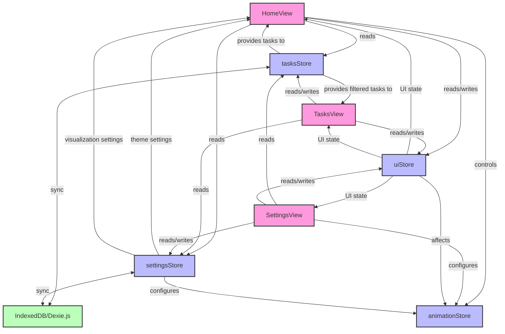

# Implementation Plan: Cyberpunk Space Todo/Timer PWA

This document outlines the comprehensive implementation plan for the Cyberpunk Space Todo/Timer PWA project, detailing the architecture, technical stack, and development phases.

## 1. Project Architecture & Technical Framework

Our application follows a modern frontend architecture with these key layers:

- **Core Layer**: Vite build system, TypeScript, PWA configuration
- **UI Layer**: Mantine UI extensions (CyberComponents), custom theming
- **Feature Layer**: Task management, time visualization, user settings
- **State Layer**: Pinia stores with modular organization
- **Persistence Layer**: IndexedDB via Dexie.js
- **Animation Systems**: Vue Motion, Three.js, Rive

### Architecture Diagram

```mermaid
graph TD
    classDef core fill:#f9d,stroke:#333,stroke-width:2px
    classDef feature fill:#bbf,stroke:#333,stroke-width:2px
    classDef service fill:#bfb,stroke:#333,stroke-width:2px
    classDef storage fill:#fbb,stroke:#333,stroke-width:2px

    A[Vue 3 Application] --> B[Core]
    A --> C[Features]
    A --> D[Infrastructure]

    %% Core Layer
    B --> B1[Vite Build System]
    B --> B2[TypeScript]
    B --> B3[PWA Configuration]
    B --> B4[Mantine UI Extension]
    B1:::core
    B2:::core
    B3:::core
    B4:::core

    %% Features Layer
    C --> C1[Task Management]
    C --> C2[Time Visualization]
    C --> C3[User Settings]
    C --> C4[Theme System]
    C1:::feature
    C2:::feature
    C3:::feature
    C4:::feature

    %% Infrastructure Layer
    D --> D1[State Management/Pinia]
    D --> D2[Data Persistence]
    D --> D3[Animation Systems]
    D --> D4[WebGL Rendering]
    D1:::service
    D2:::service
    D3:::service
    D4:::service

    %% Task Management Details
    C1 --> C1a[Task CRUD]
    C1 --> C1b[Filtering & Sorting]
    C1 --> C1c[Task Recurrence]
    C1 --> C1d[Subtasks]

    %% Time Visualization Details
    C2 --> C2a[Space Environment]
    C2 --> C2b[Time Scaling]
    C2 --> C2c[Task Positioning]
    C2 --> C2d[Visual Effects]

    %% Data Persistence Details
    D2 --> D2a[IndexedDB/Dexie.js]
    D2a --> D2a1[Task Repository]
    D2a --> D2a2[Settings Repository]
    D2a:::storage
    D2a1:::storage
    D2a2:::storage

    %% Animation System Details
    D3 --> D3a[Vue Motion]
    D3 --> D3b[Rive Animations]
    D3 --> D3c[Particle Effects]

    %% WebGL Rendering Details  
    D4 --> D4a[Three.js Integration]
    D4 --> D4b[Space Environment]
    D4 --> D4c[Task Objects]
```



### Component Architecture

```mermaid
graph TD
    classDef cyber fill:#f9d,stroke:#333,stroke-width:2px
    classDef feature fill:#bbf,stroke:#333,stroke-width:2px
    classDef layout fill:#bfb,stroke:#333,stroke-width:2px

    A[App Component] --> B[Layout Components]
    A --> C[View Components]

    %% Layout Components
    B --> B1[AppHeader]
    B --> B2[AppSidebar]
    B --> B3[AppFooter]
    B --> B4[PageTransition]
    B1:::layout
    B2:::layout
    B3:::layout
    B4:::layout

    %% View Components
    C --> C1[HomeView]
    C --> C2[TasksView]
    C --> C3[SettingsView]
    C --> C4[NotFoundView]

    %% Home View Breakdown
    C1 --> C1a[SpaceVisualization]
    C1 --> C1b[TimeScaleControl]
    C1 --> C1c[TimelineLegend]
    C1a --> C1a1[TaskEntity]
    C1a --> C1a2[Space Background]
    C1b --> C1b1[CyberSlider]

    %% Tasks View Breakdown
    C2 --> C2a[ViewToggle]
    C2 --> C2b[TaskList/Grid]
    C2 --> C2c[TaskFilter]
    C2 --> C2d[QuickAddTask]
    C2b --> C2b1[TaskItem]
    C2b1 --> C2b1a[TaskModal]

    %% Settings View Breakdown
    C3 --> C3a[ThemeSettings]
    C3 --> C3b[PerformanceSettings]
    C3 --> C3c[NotificationSettings]
    C3 --> C3d[DataManagement]

    %% Cyber Components
    D[CyberComponents Library] --> D1[Input Components]
    D --> D2[Display Components]
    D --> D3[Interactive Components]
    D1 --> D1a[CyberInput]
    D1 --> D1b[CyberSelect]
    D1 --> D1c[CyberCheckbox]
    D2 --> D2a[CyberCard]
    D2 --> D2b[CyberBadge]
    D2 --> D2c[CyberProgressBar]
    D3 --> D3a[CyberButton]
    D3 --> D3b[CyberToggle]
    D3 --> D3c[CyberSlider]
    D1a:::cyber
    D1b:::cyber
    D1c:::cyber
    D2a:::cyber
    D2b:::cyber
    D2c:::cyber
    D3a:::cyber
    D3b:::cyber
    D3c:::cyber
```



### Data Flow Architecture



## 2. Comprehensive Technology Stack

| Category | Technologies | Purpose |
|----------|-------------|---------|
| **Core Framework** | Vue 3 + TypeScript | Main application framework with type safety |
| **Build System** | Vite | Fast, modern build system optimized for Vue 3 |
| **PWA Support** | Vite PWA Plugin | Service worker, manifest, and offline capabilities |
| **UI Framework** | Mantine UI | Modern component library for base components |
| **State Management** | Pinia | Vue 3's recommended state management solution |
| **Data Persistence** | Dexie.js (IndexedDB) | Client-side database for offline-first approach |
| **Routing** | Vue Router | Application navigation with code splitting |
| **3D/WebGL** | Three.js | 3D rendering for space visualization |
| **Animation** | Vue Motion + Rive | Task motion effects + micro-animations |
| **Styling** | SCSS + CSS Variables | Custom cyberpunk theming with dark/light support |
| **Testing** | Vitest + Testing Library | Unit, component, and integration testing |
| **Code Quality** | ESLint + Prettier | Consistent code style and quality |
| **Internationalization** | Vue I18n | Multi-language support (optional) |
| **Optimization** | Web Workers | Heavy computation off main thread |

## 3. Development Phases

### Phase 1: Infrastructure Setup

1. **Project Initialization**
   - Create Vue 3 project with TypeScript and Vite
   - Configure directory structure following Vue 3 best practices
   - Set up ESLint and Prettier with cyberpunk-specific rules
   - Configure TypeScript settings for strict type checking
   - Add path aliases for improved imports

2. **PWA Configuration**
   - Configure Vite PWA plugin with auto-update strategy
   - Set up manifest.json with app icons and theme colors
   - Configure service worker for offline support
   - Implement offline caching strategies
   - Set up push notification foundation

3. **Base UI Integration**
   - Install and configure Mantine UI
   - Create comprehensive theming system with CSS variables
   - Develop dark/light theme foundation with smooth transitions
   - Set up SCSS structure with variables, mixins, and utilities
   - Implement responsive design utilities

4. **State Management Setup**
   - Configure Pinia store with modular organization
   - Create core store modules:
     - Settings store for theme and app preferences
     - Tasks store for task data management
     - UI store for interface state
   - Implement persistence layer with localStorage and Dexie.js
   - Set up TypeScript interfaces for state types

5. **Routing & Navigation**
   - Configure Vue Router with code-splitting
   - Set up route guards and metadata
   - Create animated page transitions
   - Implement route-based document titles
   - Set up basic lazy-loaded route components

**Deliverables:**
- Functioning application shell with header, content, and footer
- Basic routing between Home, Tasks, Settings and 404 pages
- Dark/light theme switching with smooth transitions
- Full TypeScript integration with strict type checking
- PWA configuration with offline support
- Initial state management system with persistence

### Phase 2: CyberComponents Library

1. **Core Input Components**
   - **CyberInput**: Cyberpunk-styled text input with validation states
     - Implement focus and hover effects with glow
     - Add validation state styling (success, error, warning)
     - Create character counter variation
     - Build search input variation with icon
   - **CyberCheckbox**: Custom checkbox with animation
     - Create animated check mark with SVG
     - Implement focus and indeterminate states
     - Add keyboard accessibility
   - **CyberRadio**: Radio button with cyberpunk styling
     - Create animated selection effect
     - Implement grouped radio buttons
     - Ensure keyboard navigation between options
   - **CyberSelect**: Select dropdown with custom styling
     - Design dropdown menu with cyberpunk styling
     - Add multi-select capability
     - Implement searchable functionality
     - Create animated dropdown transition

2. **Display Components**
   - **CyberCard**: Card component with glowing borders
     - Implement glass effect background
     - Create hover animation with glow
     - Add multiple card variations (flat, elevated, outlined)
     - Design loading state skeleton
   - **CyberBadge**: Status badge for task states
     - Create variations for priority levels and status types
     - Implement pill and square variations
     - Add icon support
   - **CyberTooltip**: Information tooltip with futuristic styling
     - Create animated entrance/exit
     - Implement different positions (top, right, bottom, left)
     - Add arrow option
   - **CyberProgressBar**: Progress indicator with cyber styling
     - Design determinate and indeterminate variations
     - Create animated progress effect
     - Implement color variations for different states
     - Add label and percentage display options

3. **Interactive Components**
   - **CyberButton**: Custom button with hover effects
     - Implement multiple button variants (primary, secondary, ghost)
     - Create loading state with animation
     - Add icon support (leading, trailing)
     - Design button group component
   - **CyberToggle**: Toggle switch with sliding neon effect
     - Create smooth transition animation
     - Implement label support
     - Add focus and disabled states
   - **CyberSlider**: Slider for time scale visualization
     - Design track and thumb with cyberpunk styling
     - Implement value tooltip
     - Create range slider variation
     - Add step markers option
     - Design logarithmic scale display

4. **Layout Components**
   - **CyberModal**: Base modal with blur backdrop
     - Create animated entrance/exit transitions
     - Implement close button and escape key closing
     - Add stacking support for multiple modals
     - Design different size variations
   - **AppHeader**: Application header with navigation
     - Implement responsive design for mobile/desktop
     - Create active route indication
     - Add theme toggle integration
   - **AppFooter**: Application footer
     - Design responsive layout
     - Add credit and version information
   - **PageTransition**: Animated route transitions
     - Create fade transition
     - Implement slide transitions
     - Add configurable transition timing

**Deliverables:**
- Complete CyberComponents library with all planned components
- Comprehensive component documentation
- Working components with proper TypeScript typing
- Custom styling built on top of Mantine
- Accessible component implementation with ARIA support
- Keyboard navigation for all interactive components

### Phase 3: Task Management System

1. **Data Model Implementation**
   - **Task Interface**: Define complete Task type with all properties
     - Core fields (title, description, due date)
     - Metadata (created/updated timestamps, status)
     - Extended properties (priority, tags, color, effect type)
     - Recurring task pattern definition
     - Notification settings structure
     - Subtasks implementation
     - History tracking fields
   - **Dexie.js Setup**: Configure database schema
     - Define table structure
     - Set up indexes for efficient querying
     - Implement version migration system
     - Create upgrade handlers
   - **Repository Pattern**: Create data access layer
     - Define repository interface
     - Implement CRUD operations
     - Create query methods with filtering
     - Set up transaction handling

2. **Task CRUD Operations**
   - **Create Task**: Implement task creation
     - Design task creation workflow
     - Implement validation rules
     - Set default values from user preferences
     - Generate unique IDs
     - Add history tracking for creation
   - **Read Task**: Retrieve tasks with filtering
     - Implement efficient querying
     - Create indexed lookups
     - Design batch retrieval
     - Implement pagination for large datasets
   - **Update Task**: Modify existing tasks
     - Track modifications in history
     - Implement optimistic updates
     - Handle validation
     - Create partial update capability
   - **Delete Task**: Remove tasks safely
     - Implement soft delete option
     - Add confirmation flow
     - Handle related data cleanup
     - Create batch deletion capability

3. **Task Organization & Filtering**
   - **Tag System**: Implement task categorization
     - Create tag management
     - Implement tag creation, editing, deletion
     - Design tag color assignment
     - Build tag filtering interface
   - **Advanced Filtering**: Create comprehensive filter system
     - Filter by multiple criteria (due date, status, priority)
     - Implement date range filtering
     - Create tag-based filtering
     - Build text search functionality
     - Design filter combination logic (AND/OR)
   - **Sorting Capabilities**: Order tasks by different fields
     - Implement multi-field sorting
     - Create sort direction toggle
     - Design custom sort functions
     - Add drag-and-drop reordering

4. **Advanced Task Features**
   - **Recurring Task System**: Implement repeat patterns
     - Define recurrence patterns (daily, weekly, monthly, yearly)
     - Create custom recurrence rules
     - Implement end conditions (count, date)
     - Design exception handling
     - Build occurrence generation algorithm
   - **Subtasks**: Create nested task functionality
     - Implement subtask UI
     - Track completion progress
     - Create validation rules
     - Design completion tracking
   - **Task History**: Track changes over time
     - Record all modifications
     - Store previous state
     - Create audit trail
     - Design history view interface
   - **Task Relations**: Connect related tasks
     - Implement dependency relationships
     - Create blocked/blocking status
     - Design related task view

**Deliverables:**
- Robust task data model with complete TypeScript types
- Fully functional CRUD operations with validation
- Efficient persistence layer with IndexedDB
- Advanced filtering and sorting system
- Complete tag management
- Working recurring task implementation
- Subtask functionality with progress tracking
- Comprehensive history and audit trail

### Phase 4: Time Visualization System

1. **Three.js Integration**
   - **WebGL Setup**: Configure Three.js environment
     - Initialize renderer with proper settings
     - Configure WebGL parameters
     - Set up camera system
     - Implement responsive canvas sizing
     - Create render loop with efficient updates
   - **Space Environment**: Create cosmic background
     - Design starfield generation
     - Implement nebula effects
     - Create parallax scrolling depth
     - Add ambient animation
     - Design lighting system
   - **Camera Controls**: Implement user interaction
     - Create orbit controls for desktop
     - Implement touch controls for mobile
     - Design zoom functionality
     - Add camera damping for smooth movement
     - Implement view boundaries

2. **Task Visualization**
   - **Task Representation**: Design 3D task objects
     - Create geometric shapes for tasks
     - Implement color coding by priority
     - Design size variation by importance
     - Add glow effects for emphasis
     - Create completion state visuals
   - **Positioning Algorithm**: Place tasks in 3D space
     - Implement logarithmic time scale
     - Create stable positioning system
     - Design collision avoidance
     - Implement grouping for related tasks
     - Create even distribution algorithm
   - **Task Animation**: Add motion to tasks
     - Design approach animation as due date nears
     - Create hover effects for selection
     - Implement completion animation with particles
     - Add subtle idle animation
     - Design transition animations for filtering

3. **Time Scale Control**
   - **Logarithmic Scale**: Implement non-linear time representation
     - Create conversion functions between time and distance
     - Design scale markers at meaningful intervals
     - Implement adaptive scale based on task density
     - Create smooth scale transitions
   - **Zoom Functionality**: Control time range display
     - Implement mousewheel zoom
     - Create pinch-to-zoom for touch devices
     - Design zoom limits
     - Add smooth zoom animation
     - Create snap-to-scale functionality
   - **Time Markers**: Visualize time intervals
     - Implement day/week/month/year markers
     - Design adaptive marker density
     - Create date formatting system
     - Add current time indicator
     - Implement marker labels

4. **Effects & Interactions**
   - **Particle System**: Create visual effects
     - Implement particle generator
     - Design particle behavior for task completion
     - Create ambient space particles
     - Optimize particle rendering
     - Add motion trails for moving objects
   - **Task Selection**: Implement user interaction
     - Create raycasting for object selection
     - Design highlight effect for selected task
     - Implement click/tap handling
     - Create task detail popup
     - Add context menu for actions
   - **Visual Cues**: Provide additional information
     - Design priority indicators
     - Implement due soon warnings
     - Create overdue visual treatment
     - Add completion status effects
     - Design tag visualization in 3D space

**Deliverables:**
- Complete 3D visualization system with Three.js
- Immersive space environment with effects
- Working task positioning based on due dates
- Interactive camera system with zoom controls
- Time scale visualization with markers
- Interactive task selection and detail view
- Visual effects for task states and animations
- Optimized rendering for different devices

### Phase 5: Views Implementation

1. **Home View (Timeline)**
   - **Space Visualization**: Integrate 3D environment
     - Embed WebGL canvas
     - Handle resize events
     - Implement performance optimizations
     - Create loading state
     - Design error fallback
   - **Time Controls**: Create timeline interaction
     - Implement time scale slider
     - Create zoom controls
     - Design time navigation
     - Add current time indicator
     - Implement time range selection
   - **Information Display**: Add contextual information
     - Create timeline legend
     - Design task count indicators
     - Implement priority distribution view
     - Add quick filters
     - Create help overlay for new users

2. **Tasks View**
   - **View Modes**: Implement list and card layouts
     - Create toggle between view modes
     - Design responsive grid layout
     - Implement list view with details
     - Create compact view option
     - Add animation between view changes
   - **Section Organization**: Group tasks logically
     - Implement overdue section with warnings
     - Create active tasks section
     - Design completed tasks area
     - Add collapsible sections
     - Implement drag-and-drop between sections
   - **Task Management**: Enable actions on tasks
     - Create quick actions (complete, edit, delete)
     - Implement batch selection
     - Design batch operations interface
     - Add sorting controls
     - Create filter panel

3. **Settings View**
   - **Theme Configuration**: Customize appearance
     - Implement theme toggle with preview
     - Create custom accent color selection
     - Design font size controls
     - Add interface density options
     - Implement animation intensity settings
   - **Performance Settings**: Optimize experience
     - Create performance mode toggle
     - Design background complexity controls
     - Implement particle density settings
     - Add WebGL quality options
     - Create frame rate limiter
   - **Data Management**: Handle user data
     - Implement data export functionality
     - Create import system
     - Design data backup options
     - Add clear data capability with confirmation
     - Implement migration tools

4. **Task Modal**
   - **Form Interface**: Create comprehensive task editor
     - Design intuitive layout with sections
     - Implement all task fields
     - Create validation system
     - Add rich text editing for description
     - Implement tag management
   - **Date & Time**: Handle temporal information
     - Create date picker with cyberpunk styling
     - Implement time selector
     - Design recurring pattern interface
     - Add due date visualization
     - Create reminder settings
   - **Advanced Options**: Add extended functionality
     - Implement subtask management
     - Create color selection
     - Design effect type chooser
     - Add priority selector
     - Implement related task linking

**Deliverables:**
- Complete view implementations with full functionality
- Working 3D visualization on home page
- Task list/grid view with filtering and sorting
- Comprehensive settings panel with all options
- Full-featured task creation/editing modal
- Responsive designs for all screen sizes
- Animated transitions between views and states
- Comprehensive error handling and loading states

### Phase 6: Polishing & Optimization

1. **Performance Optimization**
   - **Code Splitting**: Reduce initial load size
     - Implement route-based code splitting
     - Create dynamic imports for heavy components
     - Optimize chunk sizes
     - Design loading strategy
     - Implement preloading for common routes
   - **Virtualized Lists**: Handle large datasets
     - Create virtual scrolling for task lists
     - Implement efficient DOM recycling
     - Design placeholder system
     - Add smooth scrolling
     - Optimize render performance
   - **Rendering Optimization**: Improve WebGL performance
     - Implement instance rendering
     - Create level-of-detail system
     - Design object pooling
     - Add frustum culling
     - Implement occlusion culling
     - Create adaptive quality settings

2. **Accessibility Improvements**
   - **Keyboard Navigation**: Ensure non-mouse usability
     - Implement focus management
     - Create intuitive tab order
     - Add keyboard shortcuts
     - Design focus indicators
     - Implement alternative controls for 3D view
   - **Screen Reader Support**: Ensure assistive technology compatibility
     - Add ARIA attributes
     - Implement semantic HTML
     - Create descriptive labels
     - Design live regions for updates
     - Add text alternatives for visual elements
   - **Reduced Motion**: Support motion sensitivity
     - Implement reduced motion detection
     - Create alternative animations
     - Design static alternatives for motion effects
     - Add user preference controls
     - Ensure critical information doesn't rely on animation

3. **Final Testing**
   - **Unit Testing**: Validate individual components
     - Test core functionality
     - Implement component testing
     - Create test fixtures and mocks
     - Design edge case tests
     - Implement CI integration
   - **Integration Testing**: Verify component interaction
     - Test store interactions
     - Create user flow tests
     - Implement API mocking
     - Design state testing
     - Add visual regression tests
   - **End-to-End Testing**: Validate complete application
     - Create critical path tests
     - Implement real database testing
     - Design multi-view tests
     - Add performance benchmarks
     - Create accessibility audits

4. **Documentation & Deployment**
   - **User Documentation**: Create help resources
     - Design in-app tutorials
     - Create help pages
     - Implement tooltips and hints
     - Add keyboard shortcut guide
     - Create FAQ section
   - **Developer Documentation**: Support codebase maintenance
     - Document architecture decisions
     - Create component API documentation
     - Design development guidelines
     - Implement code comments
     - Create onboarding guide
   - **Deployment Strategy**: Prepare for release
     - Configure build optimization
     - Create deployment pipeline
     - Design update strategy
     - Implement analytics
     - Add error tracking

**Deliverables:**
- Optimized application with performant rendering
- Fully accessible interface with screen reader support
- Comprehensive test suite with high coverage
- Complete documentation for users and developers
- Production-ready build configuration
- Deployment pipeline for continuous delivery

## 4. Technical Approach for Key Features

### Task Positioning in 3D Space

Tasks will be positioned using a logarithmic scale based on due date proximity:

```javascript
function calculateTaskPosition(task) {
  const now = new Date();
  const timeUntilDue = task.dueDate - now;
  
  // Logarithmic mapping to determine distance from center
  const distance = timeUntilDue <= 0 
    ? MIN_DISTANCE // Overdue tasks
    : MIN_DISTANCE + (MAX_DISTANCE - MIN_DISTANCE) * 
      (1 - 1 / (1 + Math.log10(1 + timeUntilDue / DAY_IN_MS)));
  
  // Position in 3D space with some randomization
  const angle = generateStableAngleForTask(task.id);
  
  return {
    x: Math.cos(angle) * distance,
    y: (Math.random() - 0.5) * VERTICAL_SPREAD, // Some randomness in height
    z: Math.sin(angle) * distance
  };
}
```

### Recurring Task System

```javascript
function generateTaskOccurrences(recurringTask, range) {
  const occurrences = [];
  let currentDate = new Date(recurringTask.dueDate);
  
  while (currentDate <= range.end && 
    (!recurringTask.recurringPattern.endDate || 
     currentDate <= recurringTask.recurringPattern.endDate)) {
    
    // Create a new task instance for this occurrence
    occurrences.push({
      ...recurringTask,
      id: generateId(),
      dueDate: new Date(currentDate),
      isOccurrence: true,
      parentTaskId: recurringTask.id
    });
    
    // Calculate next occurrence based on pattern
    currentDate = getNextOccurrenceDate(
      currentDate, 
      recurringTask.recurringPattern
    );
  }
  
  return occurrences;
}

// Calculate the next occurrence date based on recurrence pattern
function getNextOccurrenceDate(currentDate, pattern) {
  const nextDate = new Date(currentDate);
  
  switch (pattern.frequency) {
    case 'daily':
      nextDate.setDate(nextDate.getDate() + pattern.interval);
      break;
    case 'weekly':
      if (pattern.daysOfWeek && pattern.daysOfWeek.length) {
        // Find the next day of week that matches the pattern
        // More complex logic here for handling multiple days of week
      } else {
        nextDate.setDate(nextDate.getDate() + (pattern.interval * 7));
      }
      break;
    case 'monthly':
      nextDate.setMonth(nextDate.getMonth() + pattern.interval);
      break;
    case 'yearly':
      nextDate.setFullYear(nextDate.getFullYear() + pattern.interval);
      break;
  }
  
  return nextDate;
}
```

### Theming System

```typescript
// Theme definition with dark and light modes
interface CyberTheme {
  colors: {
    primary: string;
    secondary: string;
    accent: string;
    background: {
      main: string;
      card: string;
      input: string;
    },
    text: {
      primary: string;
      secondary: string;
      accent: string;
    },
    priority: {
      low: string;
      medium: string;
      high: string;
      critical: string;
    }
  },
  effects: {
    glow: string;
    shadow: string;
    glassMorphism: string;
  },
  animation: {
    timing: string;
    duration: {
      fast: string;
      normal: string;
      slow: string;
    }
  }
}

// Implementation with CSS variables
function applyTheme(theme: 'dark' | 'light' | 'system') {
  const root = document.documentElement;
  
  // First determine actual theme based on system preference if needed
  let actualTheme = theme;
  if (theme === 'system') {
    actualTheme = window.matchMedia('(prefers-color-scheme: dark)').matches 
      ? 'dark' 
      : 'light';
  }
  
  // Add transition class for smooth theme switch
  root.classList.add('theme-transition');
  
  // Set the theme attribute
  root.setAttribute('data-theme', actualTheme);
  
  // Apply theme-specific colors and effects
  const themeData = actualTheme === 'dark' ? darkTheme : lightTheme;
  
  // Apply colors
  Object.entries(themeData.colors).forEach(([key, value]) => {
    if (typeof value === 'object') {
      Object.entries(value).forEach(([subKey, subValue]) => {
        root.style.setProperty(
          `--color-${key}-${subKey}`, 
          subValue
        );
      });
    } else {
      root.style.setProperty(
        `--color-${key}`, 
        value
      );
    }
  });
  
  // Apply effects and animations
  Object.entries(themeData.effects).forEach(([key, value]) => {
    root.style.setProperty(`--effect-${key}`, value);
  });
  
  Object.entries(themeData.animation).forEach(([key, value]) => {
    if (typeof value === 'object') {
      Object.entries(value).forEach(([subKey, subValue]) => {
        root.style.setProperty(
          `--${key}-${subKey}`, 
          subValue
        );
      });
    } else {
      root.style.setProperty(
        `--${key}`, 
        value
      );
    }
  });
  
  // Remove transition class after animation completes
  setTimeout(() => {
    root.classList.remove('theme-transition');
  }, 500);
}
```

### Pinia Store

Our application utilizes Pinia as the state management solution, taking advantage of its modular design and Vue 3 composition API integration. We use a combination of setup stores and fine-grained reactivity to create a powerful but maintainable state management system.

```typescript
// Store Organization
// Three primary store modules with clear responsibilities

// Core store setup pattern
const useTasksStore = defineStore('tasks', () => {
  // State (reactive references)
  const tasks = ref<Task[]>([])
  const isLoading = ref(false)
  const activeFilter = ref<TaskFilter>({ status: 'all' })
  
  // Getters (computed values)
  const filteredTasks = computed(() => {
    // Filter logic based on activeFilter.value
    return tasks.value.filter(/* filtering logic */)
  })
  
  const tasksByPriority = computed(() => {
    // Group tasks by priority
    return groupBy(tasks.value, 'priority')
  })
  
  // Actions (functions that modify state)
  function addTask(task: Partial<Task>) {
    // Create a new task with defaults and validation
    const newTask: Task = {
      id: generateId(),
      createdAt: new Date(),
      // ...defaults merged with provided values
      ...task
    }
    
    // Add to state
    tasks.value.push(newTask)
    
    // Persist to database
    saveTaskToDatabase(newTask)
  }
  
  // Additional actions, getters, etc.
  
  // Return public interface
  return {
    // Expose state
    tasks,
    isLoading,
    activeFilter,
    
    // Expose getters
    filteredTasks,
    tasksByPriority,
    
    // Expose actions
    addTask,
    // Additional exposed functions
  }
})
```

#### Store Modules

1. **Settings Store**
   - Manages application preferences
   - Handles theme configuration
   - Controls performance settings
   - Persists settings to localStorage
   - Implements system theme detection and synchronization
   - Provides methods for settings reset and default configurations

2. **UI Store**
   - Maintains transient UI state (modals, drawers, notifications)
   - Provides loading and error state management
   - Controls animations and transitions
   - Manages responsive layout preferences
   - Handles user interactions and events not tied to business logic

3. **Tasks Store**
   - Implements the core task data CRUD operations
   - Provides filtering, sorting, and searching capabilities
   - Manages task metadata (tags, priorities, etc.)
   - Handles recurring task logic and generation
   - Implements data synchronization with IndexedDB
   - Provides optimistic updates for improved UX

#### Data Persistence Strategy

The stores implement a layered persistence approach:

1. **Memory**: Primary state is kept in reactive Pinia stores for runtime access
2. **localStorage**: Settings and UI preferences are persisted to localStorage
3. **IndexedDB**: Task data is stored in IndexedDB via Dexie.js for larger datasets
4. **Export/Import**: Full data backup & restore capabilities with JSON export/import

```typescript
// Example: Persistence implementation for tasks
function initializeTasksFromDatabase() {
  isLoading.value = true
  
  return db.tasks
    .toArray()
    .then(loadedTasks => {
      // Process loaded tasks (convert dates, etc.)
      const processedTasks = loadedTasks.map(processTaskDates)
      
      // Replace store state with database content
      tasks.value = processedTasks
      
      return processedTasks
    })
    .catch(error => {
      console.error('Failed to initialize tasks:', error)
      return []
    })
    .finally(() => {
      isLoading.value = false
    })
}

// Automatic persistence
watch(tasks, async (newTasks) => {
  try {
    // Batch database operations for better performance
    await db.transaction('rw', db.tasks, async () => {
      // Identify changes and sync them to the database
      // (More complex logic for efficient updates)
    })
  } catch (error) {
    console.error('Failed to persist tasks:', error)
  }
}, { deep: true })
```

#### Store Interaction Patterns

Our stores communicate through these established patterns:

1. **Direct Import**: Components import only the stores they need directly
2. **Store Composition**: Stores can import and use other stores when needed
3. **Event-Based**: Action sequence coordination using custom events
4. **Watcher-Based**: Stores react to changes in other stores through watchers

```typescript
// Example: Cross-store interaction
const settingsStore = useSettingsStore()
const uiStore = useUIStore()

// Watch for theme changes and show notification
watch(
  () => settingsStore.theme,
  (newTheme) => {
    uiStore.addNotification({
      type: 'info',
      message: `Theme changed to ${newTheme}`,
      duration: 3000
    })
  }
)
```

#### TypeScript Integration

All stores are fully typed with TypeScript for improved developer experience and type safety:

```typescript
// Store state types
interface TasksState {
  tasks: Task[]
  isLoading: boolean
  activeFilter: TaskFilter
  sortOrder: SortOrder
}

// Store return type
interface TasksStore {
  // State
  tasks: Ref<Task[]>
  isLoading: Ref<boolean>
  activeFilter: Ref<TaskFilter>
  
  // Getters
  filteredTasks: ComputedRef<Task[]>
  tasksByPriority: ComputedRef<Record<TaskPriority, Task[]>>
  
  // Actions
  addTask: (task: Partial<Task>) => Task
  updateTask: (id: string, updates: Partial<Task>) => Task | null
  deleteTask: (id: string) => boolean
  
  // Additional methods...
}
```

This modular, typed approach to state management with Pinia gives us the flexibility to handle complex application state while maintaining a clear separation of concerns and excellent developer experience.
