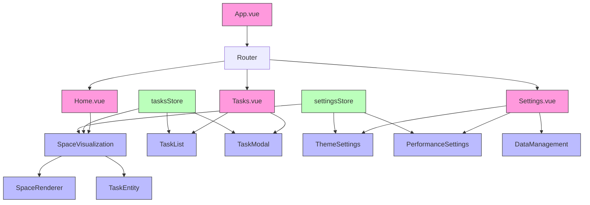

# Phase 5 Implementation: Views Implementation

This phase focused on implementing and connecting the core views of the application, bringing together all the components created in previous phases into a cohesive user experience.

## Key Accomplishments

### 1. Home View Implementation

- Integrated the SpaceVisualization component into the Home view
- Added task statistics panel showing active, overdue, today's tasks, and completion rate
- Implemented time scale controls with logarithmic scaling
- Created the timeline legend explaining the visualization system
- Added responsive design for various screen sizes

### 2. Settings View Implementation

- Created comprehensive settings management with four main sections:
  - Theme Settings: Theme mode, accent color, interface density, and font size
  - Performance Settings: Performance mode, WebGL quality, particle density, and animation intensity
  - Data Management: Export/import functionality and data reset options
  - Task Defaults: Default priority and effect type settings
- Implemented real-time preview for font size changes
- Added color picker for accent color selection
- Created custom CyberToggleGroup component for option selection
- Implemented persistent settings storage

### 3. Task Modal Refinement

- Enhanced the task editing interface
- Improved validation and user feedback
- Added support for subtasks, tags, and recurring patterns
- Implemented proper date/time selection with cyberpunk styling

### 4. View Connections and Navigation

- Ensured proper data flow between views through Pinia stores
- Implemented smooth transitions between views
- Added proper error handling and loading states

## Technical Implementation Details

### Component Architecture

The views now properly connect various components created in earlier phases:

### Store Enhancements

- Added import/export capabilities to the Tasks store
- Enhanced Settings store with support for theme, performance, and UI customization
- Implemented persistence for user preferences
- Added type definitions for improved type safety

### Custom Components

Several new components were created:

- **CyberToggleGroup**: A toggle component for selecting between multiple options
- **TimeScaleControl**: A slider with custom scaling for time visualization
- **StatisticsPanel**: A component for displaying task statistics

## Challenges and Solutions

### Type Safety

- Enhanced TypeScript type definitions for better development experience
- Used type aliases for consistent typing across components
- Improved component props with proper type annotations

### Performance Considerations

- Implemented performance mode for lower-end devices
- Added control for WebGL quality and particle density
- Created adaptive rendering based on device capabilities

### Data Management

- Added robust data export/import with error handling
- Implemented data validation on import
- Created clear data functionality with confirmation dialog

## Next Steps

Now that the core views are implemented, the next phase will focus on:

1. Testing and optimization
2. Further polish and animations
3. Improved accessibility features
4. Finalization of PWA configuration

With Phase 5 complete, the application now has a fully functional user interface connecting all the previously built components into a cohesive user experience.
